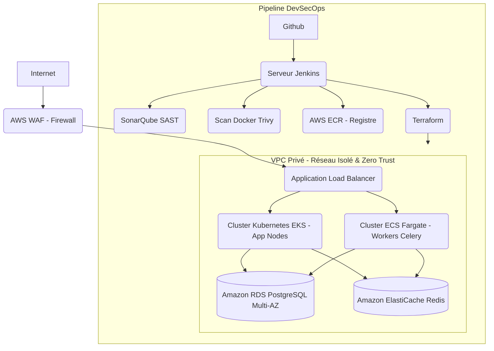

# ☁️ Déploiement Cloud AWS & DevSecOps (Terraform, Jenkins, Docker)

Bienvenue dans la documentation d'infrastructure du projet. Ce dépôt illustre une approche **Cloud-Native**, hautement disponible et sécurisée, déployée sur **AWS** via **Terraform** avec un pipeline **CI/CD Jenkins** de pointe.

L'objectif de cette architecture est de démontrer une maîtrise approfondie des standards industriels de production : **Haute Disponibilité (HA)**, **Tolérance aux pannes**, **Sécurité "Zero Trust"** (DevSecOps) et **FinOps/Green IT**.

---

## 🏗️ 1. Architecture Cloud AWS (Haute Disponibilité & Multi-AZ)

L'infrastructure est conçue pour être résiliente et scalable horizontalement, répartie sur **3 Zones de Disponibilité (AZs)**.

### 🧠 Choix Technologiques & Bonnes Pratiques
* **Calcul (Compute) :** AWS EKS (Kubernetes) ou ECS Fargate pour une isolation forte des microservices. L'utilisation des processeurs ARM (AWS Graviton) offre un ratio performance/coût exceptionnel et réduit l'empreinte carbone.
* **Base de données :** Amazon RDS PostgreSQL déployé en mode `Multi-AZ` (réplication synchrone sur une autre zone) avec sauvegardes automatiques et chiffrement KMS au repos (`Encryption at rest`).
* **Sécurité (Principe de Moindre Privilège) :** 
  * Tous les composants vitaux résident dans des **Private Subnets**. Les bases de données n'ont aucune IP publique.
  * **AWS WAF** (Web Application Firewall) est attaché au Load Balancer pour contrer les menaces Top 10 OWASP (Injections SQL, XSS).
  * L'authentification entre services passe par des rôles **IAM** restreints (pas de clés d'accès statiques).

---

## 🛠️ 2. Infrastructure as Code (Terraform)

Toute l'infrastructure est codée en HCL (HashiCorp Configuration Language), garantissant une infrastructure reproductible, sans erreur humaine, et auditable.

* **Gestion Sécurisée de l'État (Remote State) :** Le fichier critique `terraform.tfstate` est stocké dans un bucket **Amazon S3** privé et chiffré. 
* **State Locking :** Utilisation d'**Amazon DynamoDB** pour verrouiller l'état, évitant ainsi toute corruption si deux ingénieurs tentent un déploiement simultané.
* **Modularité :** Découpage strict en modules (`network`, `compute`, `database`) rendant le code "DRY" (Don't Repeat Yourself).

---

## 🚀 3. Pipeline CI/CD DevSecOps (Jenkins)

Le `Jenkinsfile` déclare un pipeline "Shift-Left Security", intégrant la sécurité au plus tôt dans le cycle de vie du code.

**Les Étapes du Pipeline :**
1. **Tests & Linting :** Exécution de Pytest (Couverture garantie > 85%).
2. **Analyse Statique (SAST) :** **SonarQube** analyse le code source à la recherche de "code smells", de bugs et de vulnérabilités.
3. **Build & Scan Docker :** Construction d'images Docker légères (Multi-stage builds) puis scan rigoureux avec **Trivy**. **Le pipeline échoue (Fail Fast)** si une vulnérabilité `CRITICAL` ou `HIGH` (CVE) est détectée dans l'image.
4. **AWS ECR :** Push sécurisé de l'image vérifiée sur Amazon Elastic Container Registry.
5. **Déploiement Terraform :** Exécution automatique d'un `terraform plan`.
6. **Validation de Production :** Une étape de validation manuelle (`input`) est exigée avant le `terraform apply` final en production pour garantir le contrôle humain.

---

## 🌍 4. Numérique Responsable (Green IT) & FinOps

En tant qu'ingénieur Senior, l'impact écologique et financier de l'architecture est une priorité absolue :
* **Auto-Scaling intelligent :** Scale-in drastique des conteneurs la nuit et les week-ends via des métriques CloudWatch.
* **Architecture Serverless :** Sur ECS Fargate, l'entreprise ne paie que pour le temps de calcul exact consommé à la seconde près. Finies les VM sous-exploitées allumées H24.
* **Stockage Froid (S3 Lifecycle) :** Archivage automatique des vieux logs d'audit vers **Amazon S3 Glacier** (stockage très basse consommation et ultra-économique).
